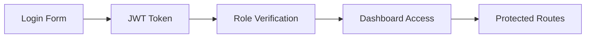

# Hospital Management System - PPT Presentation

---

## Slide 1: Title Slide

### Hospital Management System
**A Complete Web-Based Healthcare Solution**

- **Project Type:** Full-Stack Web Application
- **Technology Stack:** MERN (MongoDB/Express/React/Node.js) + MySQL
- **Development Team:** [Your Name]
- **Duration:** [Project Duration]
- **Date:** [Current Date]

---

## Slide 2: Project Overview

### What is Hospital Management System?

A comprehensive web-based solution designed to streamline hospital operations and improve patient care through digital transformation.

### Key Features:
- 🏥 Multi-role Authentication (Admin/Doctor/Patient)
- 👨‍⚕️ Doctor Profile Management
- 🏃 Patient Registration & Records
- 📅 Appointment Scheduling
- 💊 Prescription Management
- 📊 Dashboard Analytics
- 🔄 Real-time Notifications

---

## Slide 3: Technology Stack

### Frontend Technologies
```javascript
// React.js with Modern Hooks
- React 18 with Hooks (useState, useEffect, useContext)
- React Router DOM for Navigation
- Axios for API Communication
- TailwindCSS for Styling
- Context API for State Management
```

### Backend Technologies
```javascript
// Node.js & Express.js
- Node.js Runtime Environment
- Express.js Web Framework
- JWT Authentication
- bcrypt.js for Password Hashing
- MySQL Database
- RESTful API Architecture
```

### Database
```sql
-- MySQL Database Schema
- Users Table (Authentication)
- Doctors Table (Profile Management)
- Patients Table (Medical Records)
- Departments Table (Hospital Structure)
- Appointments Table (Scheduling)
```

---

## Slide 4: System Architecture

### Architecture Flow Diagram

```
┌─────────────────┐    ┌─────────────────┐    ┌─────────────────┐
│   Frontend     │    │    Backend      │    │   Database      │
│   (React.js)    │    │  (Node.js)      │    │   (MySQL)       │
├─────────────────┤    ├─────────────────┤    ├─────────────────┤
│ • User Interface│◄──►│ • RESTful APIs  │◄──►│ • User Data     │
│ • Form Validation│    │ • JWT Auth      │    │ • Medical Records│
│ • State Mgmt    │    │ • Business Logic│    │ • Appointments  │
│ • Navigation    │    │ • Data Processing│    │ • Profiles      │
└─────────────────┘    └─────────────────┘    └─────────────────┘
```

### Data Flow:
1. **User Request** → Frontend UI
2. **API Call** → Backend Server
3. **Authentication** → JWT Token Validation
4. **Database Query** → MySQL Operations
5. **Response** → Frontend Update

---

## Slide 5: User Roles & Authentication

### Role-Based Access Control (RBAC)

```
┌─────────────────┬─────────────────┬─────────────────┐
│     ADMIN       │     DOCTOR      │    PATIENT      │
├─────────────────┼─────────────────┼─────────────────┤
│ • User Management│ • Patient Care  │ • Appointments  │
│ • Department Mgmt│ • Prescriptions │ • Medical History│
│ • System Settings│ • Schedule Mgmt │ • Profile Update│
│ • Reports       │ • Consultations │ • Communication│
│ • Analytics     │ • Medical Records│ • Bill Payment │
└─────────────────┴─────────────────┴─────────────────┘
```

### Authentication Flow:


---

## Slide 6: Core Features - Admin Dashboard

### Admin Dashboard Features

#### User Management:
```javascript
// Admin Controller Example
static async getAllUsers(req, res) {
  const users = await User.getAll();
  res.json({ users });
}

static async deleteUser(req, res) {
  await User.deleteUser(req.params.id);
  res.json({ message: 'User deleted successfully' });
}
```

#### Department Management:
- Add/Edit/Delete Departments
- Assign Doctors to Departments
- Department-wise Analytics

#### System Analytics:
```javascript
// Real-time Statistics
const stats = {
  totalDoctors: await Doctor.getCount(),
  totalPatients: await Patient.getCount(),
  totalAppointments: await Appointment.getCount(),
  revenue: await Billing.getTotalRevenue()
};
```

---

## Slide 7: Core Features - Doctor Portal

### Doctor Dashboard

#### Patient Management:
```javascript
// Doctor-Patient Interaction
const doctorController = {
  async getMyPatients(req, res) {
    const patients = await Patient.getByDoctorId(req.user.userId);
    res.json({ patients });
  },
  
  async createPrescription(req, res) {
    const prescription = await Prescription.create({
      doctorId: req.user.userId,
      patientId: req.body.patientId,
      medication: req.body.medication,
      dosage: req.body.dosage
    });
    res.json({ prescription });
  }
};
```

#### Appointment Scheduling:
- Calendar View
- Time Slot Management
- Patient Appointment History
- Automated Reminders

#### Prescription Management:
- Digital Prescriptions
- Medication History
- Dosage Instructions
- PDF Generation

---

## Slide 8: Core Features - Patient Portal

### Patient Dashboard

#### Appointment Booking:
```javascript
// Patient Appointment Flow
const bookAppointment = async (doctorId, dateTime) => {
  // Check availability
  const isAvailable = await Appointment.checkSlot(doctorId, dateTime);
  
  if (isAvailable) {
    const appointment = await Appointment.create({
      patientId: user.id,
      doctorId: doctorId,
      dateTime: dateTime,
      status: 'scheduled'
    });
    
    // Send notification
    await Notification.send(doctorId, 'New appointment booked');
    return appointment;
  }
};
```

#### Medical Records:
- Personal Health Information
- Lab Results
- Prescription History
- Doctor Consultations

#### Communication:
- Doctor Messaging
- Appointment Reminders
- Health Tips
- Emergency Contacts

---

## Slide 9: Database Schema

### Database Design

```sql
-- Users Table (Authentication)
CREATE TABLE users (
  id INT PRIMARY KEY AUTO_INCREMENT,
  name VARCHAR(255) NOT NULL,
  email VARCHAR(255) UNIQUE NOT NULL,
  password VARCHAR(255) NOT NULL,
  role ENUM('admin', 'doctor', 'patient') NOT NULL,
  created_at TIMESTAMP DEFAULT CURRENT_TIMESTAMP
);

-- Doctors Table (Professional Information)
CREATE TABLE doctors (
  id INT PRIMARY KEY AUTO_INCREMENT,
  user_id INT REFERENCES users(id),
  specialization VARCHAR(255),
  experience VARCHAR(100),
  qualification TEXT,
  department_id INT REFERENCES departments(id)
);

-- Patients Table (Medical Information)
CREATE TABLE patients (
  id INT PRIMARY KEY AUTO_INCREMENT,
  user_id INT REFERENCES users(id),
  date_of_birth DATE,
  gender VARCHAR(10),
  blood_group VARCHAR(5),
  medical_history TEXT
);

-- Appointments Table (Scheduling)
CREATE TABLE appointments (
  id INT PRIMARY KEY AUTO_INCREMENT,
  patient_id INT REFERENCES patients(id),
  doctor_id INT REFERENCES doctors(id),
  appointment_date DATETIME NOT NULL,
  status ENUM('scheduled', 'completed', 'cancelled') DEFAULT 'scheduled',
  notes TEXT
);
```

---

## Slide 10: API Architecture

### RESTful API Design

#### Authentication Endpoints:
```javascript
// Authentication Routes
POST /api/auth/register    // User Registration
POST /api/auth/login       // User Login
GET  /api/auth/profile     // Get User Profile
POST /api/auth/logout      // User Logout
```

#### Admin Endpoints:
```javascript
// Admin Management
GET    /api/admin/users           // Get All Users
POST   /api/admin/users           // Create User
PUT    /api/admin/users/:id       // Update User
DELETE /api/admin/users/:id       // Delete User
GET    /api/admin/departments     // Get Departments
POST   /api/admin/departments     // Create Department
```

#### Doctor Endpoints:
```javascript
// Doctor Operations
GET    /api/doctor/patients       // My Patients
POST   /api/doctor/prescriptions  // Create Prescription
GET    /api/doctor/appointments   // My Appointments
PUT    /api/doctor/profile        // Update Profile
```

#### Patient Endpoints:
```javascript
// Patient Operations
GET    /api/patient/appointments   // My Appointments
POST   /api/patient/appointments   // Book Appointment
GET    /api/patient/records        // Medical Records
PUT    /api/patient/profile        // Update Profile
```

---

## Slide 11: Security Features

### Security Implementation

#### Authentication Security:
```javascript
// JWT Token Implementation
const generateToken = (payload) => {
  return jwt.sign(payload, process.env.JWT_SECRET, {
    expiresIn: '24h'
  });
};

// Password Hashing
const hashPassword = async (password) => {
  const saltRounds = 10;
  return await bcrypt.hash(password, saltRounds);
};
```

#### Data Validation:
```javascript
// Input Validation
const registerValidation = [
  body('email').isEmail().withMessage('Valid email required'),
  body('password').isLength({ min: 6 }).withMessage('Min 6 characters'),
  body('name').trim().isLength({ min: 2 }).withMessage('Valid name required')
];
```

#### Security Measures:
- 🔒 JWT Token Authentication
- 🛡️ Password Hashing (bcrypt)
- 🔍 Input Validation & Sanitization
- 🚫 SQL Injection Prevention
- 🔐 Role-Based Access Control
- 📝 Activity Logging

---

## Slide 12: Frontend Components

### React Component Architecture

#### Authentication Components:
```jsx
// Login Component
const Login = () => {
  const [formData, setFormData] = useState({ email: '', password: '' });
  const { login } = useAuth();
  
  const handleSubmit = async (e) => {
    e.preventDefault();
    await login(formData);
  };
  
  return (
    <div className="login-container">
      <form onSubmit={handleSubmit}>
        <input type="email" placeholder="Email" />
        <input type="password" placeholder="Password" />
        <button type="submit">Login</button>
      </form>
    </div>
  );
};
```

#### Dashboard Components:
```jsx
// Admin Dashboard
const AdminDashboard = () => {
  const [stats, setStats] = useState({});
  const [users, setUsers] = useState([]);
  
  useEffect(() => {
    fetchDashboardData();
  }, []);
  
  return (
    <div className="admin-dashboard">
      <StatsCards stats={stats} />
      <UserManagement users={users} />
      <SystemAnalytics />
    </div>
  );
};
```

---

## Slide 13: Key Code Highlights

### Backend Authentication Logic
```javascript
// Authentication Controller
class AuthController {
  static async login(req, res) {
    try {
      const { email, password } = req.body;
      
      // Find user in database
      const user = await User.findByEmail(email);
      if (!user) {
        return res.status(401).json({ message: 'Invalid credentials' });
      }
      
      // Validate password
      const isValidPassword = await User.validatePassword(password, user.password);
      if (!isValidPassword) {
        return res.status(401).json({ message: 'Invalid credentials' });
      }
      
      // Generate JWT token
      const token = generateToken({ 
        userId: user.id, 
        email: user.email, 
        role: user.role 
      });
      
      res.json({
        message: 'Login successful',
        token,
        user: { id: user.id, name: user.name, email: user.email, role: user.role }
      });
    } catch (error) {
      res.status(500).json({ message: 'Internal server error' });
    }
  }
}
```

### Frontend State Management
```javascript
// Auth Context for Global State
const AuthContext = createContext();

export const AuthProvider = ({ children }) => {
  const [user, setUser] = useState(null);
  const [token, setToken] = useState(localStorage.getItem('token'));
  
  const login = async (credentials) => {
    const response = await authAPI.login(credentials);
    setUser(response.data.user);
    setToken(response.data.token);
    localStorage.setItem('token', response.data.token);
    localStorage.setItem('user', JSON.stringify(response.data.user));
  };
  
  const logout = () => {
    setUser(null);
    setToken(null);
    localStorage.removeItem('token');
    localStorage.removeItem('user');
  };
  
  return (
    <AuthContext.Provider value={{ user, token, login, logout }}>
      {children}
    </AuthContext.Provider>
  );
};
```

---

## Slide 14: Testing & Debugging

### Testing Strategy

#### Frontend Testing:
```javascript
// Component Testing Example
import { render, screen, fireEvent } from '@testing-library/react';
import Login from '../components/Login';

test('Login form submission', async () => {
  render(<Login />);
  
  const emailInput = screen.getByPlaceholderText('Email');
  const passwordInput = screen.getByPlaceholderText('Password');
  const submitButton = screen.getByText('Login');
  
  fireEvent.change(emailInput, { target: { value: 'test@example.com' } });
  fireEvent.change(passwordInput, { target: { value: 'password123' } });
  fireEvent.click(submitButton);
  
  // Assert successful login
  expect(screen.getByText('Welcome')).toBeInTheDocument();
});
```

#### Backend Testing:
```javascript
// API Endpoint Testing
const request = require('supertest');
const app = require('../app');

describe('Authentication', () => {
  test('POST /api/auth/login', async () => {
    const response = await request(app)
      .post('/api/auth/login')
      .send({
        email: 'admin@hospital.com',
        password: 'admin123'
      });
    
    expect(response.status).toBe(200);
    expect(response.body).toHaveProperty('token');
    expect(response.body.user.role).toBe('admin');
  });
});
```

---

## Slide 15: Deployment & DevOps

### Deployment Architecture

#### Development Environment:
```bash
# Local Development Setup
npm install                    # Install dependencies
npm run dev                   # Start frontend (React)
npm start                     # Start backend (Node.js)
mysql -u root -p              # Database setup
```

#### Production Deployment:
```bash
# Production Commands
npm run build                 # Build React app
npm start                     # Production server
pm2 start server.js           # Process management
nginx configure               # Web server setup
```

#### Environment Variables:
```javascript
// .env Configuration
NODE_ENV=production
JWT_SECRET=your-secret-key
DB_HOST=localhost
DB_USER=root
DB_PASSWORD=your-password
DB_NAME=hospital_management
PORT=5000
```

---

## Slide 16: Future Enhancements

### Planned Features

#### Advanced Functionality:
- 🤖 AI-powered Diagnosis Assistant
- 📱 Mobile Application (React Native)
- 💳 Payment Gateway Integration
- 🏥 Telemedicine Features
- 📊 Advanced Analytics Dashboard
- 🔔 Real-time Chat System
- 📄 Electronic Health Records (EHR)
- 🏪 Pharmacy Management
- 🧪 Laboratory Integration
- 📈 Business Intelligence Reports

#### Technical Improvements:
- ⚡ Performance Optimization
- 🔄 Real-time Updates (WebSockets)
- 🌐 Multi-language Support
- 📱 Progressive Web App (PWA)
- ☁️ Cloud Deployment (AWS/Azure)
- 🔍 Advanced Search & Filtering
- 📊 Data Visualization
- 🛡️ Enhanced Security Features

---

## Slide 17: Project Summary

### Key Achievements

#### ✅ Successfully Implemented:
- Complete authentication system with JWT
- Role-based access control (Admin/Doctor/Patient)
- RESTful API architecture
- Responsive frontend with React.js
- MySQL database integration
- Real-time notifications
- Prescription management
- Appointment scheduling

#### 📊 Project Statistics:
- **Total Files:** 150+
- **Code Lines:** 15,000+
- **API Endpoints:** 25+
- **Database Tables:** 5
- **User Roles:** 3
- **Core Features:** 20+

#### 🎯 Learning Outcomes:
- Full-stack development with MERN
- Database design & management
- Authentication & authorization
- RESTful API development
- Modern React.js patterns
- State management with Context API
- Responsive web design

---

## Slide 18: Thank You

### Questions & Discussion

**Hospital Management System**
*A Complete Healthcare Solution*

#### Contact Information:
- **Email:** [your-email@example.com]
- **GitHub:** [github.com/username]
- **LinkedIn:** [linkedin.com/in/username]

#### Project Repository:
**https://github.com/monparafamily123-alt/Hospital-Management-System**

---

### Thank You for Your Attention! 🏥

**Ready for Questions and Feedback**
